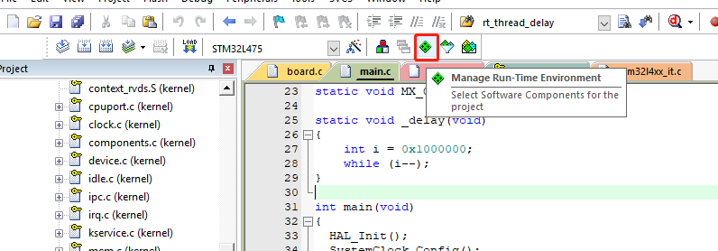

# FinSH 移植

[RT-Thread FinSH](https://www.rt-thread.org/document/site/programming-manual/finsh/finsh/) 是 RT-Thread 的命令行组件（shell），提供一套供用户在命令行调用的操作接口，主要用于调试或查看系统信息。它可以使用串口 / 以太网 / USB 等与 PC 机进行通信，使用 FinSH 组件基本命令的效果图如下所示：


本文以串口UART作为 FinSH 的输入输出端口与PC进行通信，描述如何在nano上实现FinSH shell功能。

## 1、添加FinSH组件的源码到工程

### KEIL 添加finsh源码：

点击Manage Run-Environment：



勾选device drivers与shell，这将自动把FinSH组件的源码到工程，并自动添加 `#define RTE_USING_DEVICE` 与`#define RTE_USING_FINSH` 宏：


### 其他IDE添加finsh源码：

以IAR IDE为例进行结介绍。

1、复制finsh源码到工程：直接复制nano源码中components文件夹下的finsh文件夹到工程中，如图：


2、IAR工程添加finsh源码：

- 打开工程，新建finsh分组，添加工程中finsh文件夹下的所有.c文件，如下图；
- 添加finsh文件夹的头文件路径（点击 `Project -> Options... ` 进入弹窗进行添加，如下图）；
- 在rtconfig.h中添加 `#define RTE_USING_DEVICE` 宏定义、`#define RTE_USING_FINSH` 宏定义，这样FinSH 与Device将生效，如下图。（若该文件是只读属性，则去除只读属性后再进行编辑）。

如图：


## 2、实现uart驱动

实现uart驱动，主要实现初始化与读写接口，并借助了device注册接口，将uart注册到系统中，使其更方便的对接shell。需要实现的函数原型如下：

```c
rt_err_t  (*init)   (rt_device_t dev);
rt_err_t  (*open)   (rt_device_t dev, rt_uint16_t oflag);
rt_size_t (*read)   (rt_device_t dev, rt_off_t pos, void *buffer, rt_size_t size);
rt_size_t (*write)  (rt_device_t dev, rt_off_t pos, const void *buffer, rt_size_t size);

//外加一个注册的函数，注册一个 rt_device 的实例，方便对接 FinSH 组件。
```

需要添加的代码如下所示：

```c
rt_err_t uart_init(rt_device_t dev)
{
    ...
}

rt_err_t uart_open(rt_device_t dev, rt_uint16_t oflag)
{
    return	uart_init(dev);
}

rt_size_t uart_read(rt_device_t dev, rt_off_t pos, void *buffer, rt_size_t size)
{
    ...                   
}

rt_size_t uart_write(rt_device_t dev, rt_off_t pos, const void *buffer, rt_size_t size)
{
    ...
}               

struct rt_device uart_dev;
static int uart_register(void)     
{
    uart_dev.init  = uart_init;
    uart_dev.open  = uart_open;
    uart_dev.read  = uart_read;
    uart_dev.write = uart_write;
  
    rt_device_register(&uart_dev,"uart1",0);
    return 0;
}
INIT_BOARD_EXPORT(uart_register);
```

- uart_init()：初始化串口，包括硬件引脚的初始化与串口传输模式及波特率等的设置。
- uart_open()：打开串口，使用该接口仅仅是为了对接 FinSH，没有实际意义，直接返回串口初始化即可。
- uart_read()：读入字符，长度size。
- uart_write()：输出字符，长度size。注意输出打印时，在遇到 `\n` 时，就在输出 `\n` 之前先输出一个 `\r` 。
- uart_register()：注册函数，将uart设备注册到系统中，务必使用INIT_BOARD_EXPORT()初始化该函数。

>注意：RT-Thread 系统中已有的打印均以 “\n” 结尾，而并非 “\r\n”，所以在字符输出时，需要在输出“\n”之前输出“\r”完成回车与换行，否则系统打印出来的信息将只有换行。

## 3、修改console名称

打开rtconfig.h文件：将console的名称修改为刚注册到系统中的uart名称，这样FinSH就对接到了UART端口上。如上面注册名为“uart1”，则在rtconfig.h中修改 RT_CONSOLE_DEVICE_NAME 的定义为 uart1：

```
#define RT_CONSOLE_DEVICE_NAME      "uart1"
```

## 4、下载验证

验证FinSH是否成功运行：编译下载代码，打开串口助手，可以在串口助手中打印输入 help 命令查看系统支持的命令：


如果没有成功运行，请检查UART驱动。

> 注意事项：如果输入help并回车后检测不到系统命令，则需要在rtconfig.h 打开宏  `#define FINSH_USING_SYMTAB` 。

## 附录-UART驱动示例

如下是一个基于hal库的STM32L475的串口驱动示例代码：

```c
static UART_HandleTypeDef UartHandle;
rt_err_t uart_init(rt_device_t dev)
{
    UartHandle.Instance = USART1;
    UartHandle.Init.BaudRate   = 115200;
    UartHandle.Init.HwFlowCtl  = UART_HWCONTROL_NONE;
    UartHandle.Init.Mode       = UART_MODE_TX_RX;
    UartHandle.Init.OverSampling = UART_OVERSAMPLING_16;
    UartHandle.Init.WordLength = UART_WORDLENGTH_8B;
    UartHandle.Init.StopBits   = UART_STOPBITS_1;
    UartHandle.Init.Parity     = UART_PARITY_NONE;

    if (HAL_UART_Init(&UartHandle) != HAL_OK)
    {
        while (1);
    }

    return 0;
}

rt_err_t uart_open(rt_device_t dev, rt_uint16_t oflag)
{
    return  uart_init(dev);
}

rt_size_t uart_read(rt_device_t dev,
                    rt_off_t    pos,
                    void       *buffer,
                    rt_size_t   size)
{
    while (1)
    {
        if (HAL_UART_Receive(&UartHandle, buffer, size, 20) == 0)
        {
            return size;
        }
    }
}

rt_size_t uart_write(rt_device_t dev,
                     rt_off_t    pos,
                     const void *buffer,
                     rt_size_t   size)
{
    rt_size_t i = 0;
    char a = '\r';
    const char *val = 0;    

    val = (const char *)(buffer);
    
    __HAL_UNLOCK(&UartHandle);

    for (i = 0; i < size; i++)
    {
        if (*(val + i) == '\n')
        {
            HAL_UART_Transmit(&UartHandle, (uint8_t *)&a, 1, 20);
        }
        HAL_UART_Transmit(&UartHandle, (uint8_t *)(val + i), 1, 20);
    }
    return 1;
}

struct rt_device uart_dev;
static int uart_register(void)
{
    uart_dev.init  = uart_init;
    uart_dev.open  = uart_open;
    uart_dev.read  = uart_read;
    uart_dev.write = uart_write;

    rt_device_register(&uart_dev, "uart1", 0);
    return 0;
}
INIT_BOARD_EXPORT(uart_register);
```

## 常见问题：

1、输出打印正常，却没有打印 `msh >`，也不能输入。


这是由于FinSH 没打开，所以只有打印功能，需要在rtconfig.h中打开 `#define RTE_USING_FINSH` 宏定义。