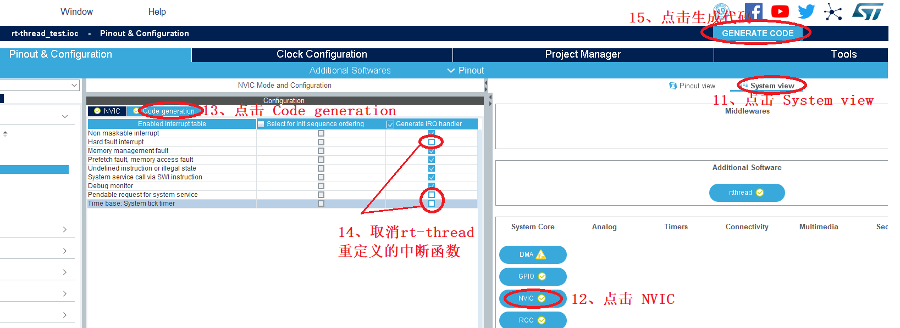

# 基于 Cube MX 5.0 的 RT-Thread Nano 使用指南

!!! abstract "摘要"
    本文介绍了使用 CubeMX 获取 RT-Thread nano 软件包步骤。

## 获取 CubeMX

CubeMX 官网下载地址 <https://www.st.com/en/development-tools/stm32cubemx.html> 。

本文创建工程基于 CubeMX 5.0.0，如果比较低的版本，建议升级，升级方式： `help -> Check for updates`，进入后，点击 Refresh，CubeMX 自动去获取最新的程序，成功获取后选择版本，点击 `Install now`，等待完成安装。

## 获取 nano 软件包

要获取 RT-Thread nano 软件包，需要在 CubeMX 中添加 <https://www.rt-thread.org/download/cube/RealThread.RT-Thread.pdsc> 。

具体步骤：进入打开 CubeMX，从菜单栏 `help` 进入 `Manage embedded software packages` 界面，点击 `From Url` 按钮，进入 `User Defined Packs Manager` 界面，其次点击 `new`，填入上述网址，然后点击 `check`，如下图步骤 1 - 5 所示

`check` 通过后，OK 按钮由灰色变成蓝色，并且旁边有显示校验通过图标，点击 OK。回到 `User Defined Packs Manager` 界面，再次点击 OK，Cube MX 自动连接服务器，获取包描述文件。回到 `Manage embedded software packages` 界面，就会发现 `RT-Thread nano 3.1.1` 软件包，选择该软件包，点击 `Install Now`，如下图步骤 6 - 7 所示

点击安装之后，弹出 `Licensing Agreement` ，同意协议，点击 `Finish`，如下图步骤 8 - 9 所示

等待安装完成，成功安装后，版本前面的小蓝色框变成填充的黄绿色，现象如下图所示

至此，RT-Thread nano 软件包安装完毕，退出 `Manage embedded software packages` 界面，进入CubeMX 主界面。

## 生成工程

本节主要介绍基于上述 CubeMX 导入的RT-Thread nano 软件包，生成 nano 工程。

### 创建新工程

在 CubeMX 主界面的菜单栏中 `File` 选择 `New Project`，如下图中步骤 1 所示

### 选择芯片型号

新建工程之后，在弹出界面芯片型号中输入某一芯片型号，方便锁定查找需要的芯片，例如 STM32L475VE，双击被选中的芯片，如下图步骤 2 所示

### 选择 RT-Thread 组件

选中芯片型号之后，点击 `Additional Softwares`，进入 `Additional Software Components selection` 界面，在 `Pack Vendor` 中选择 `RealThread`， 然后根据需求选择 RT-Thread 组件，然后点击 OK 按钮，如下图步骤 3 - 5 所示

### 配置 RT-Thread 组件

选择组件之后，对组件参数进行配置。在工程界面 `Pinout & Configuration` 中，进入所选组件参数配置区，按照下图步骤 6 - 7 所示

### 工程管理

给工程取名、选择代码存放位置、选择生成代码的 `Toolchain/IDE`。`Cube MX` 不仅能够生成 `Keil4 /Keil5` 的工程，而且还能够生成 `IAR7 /IAR8` 等 IDE 的工程，功能强大，本文从下拉框中选择 MDK5，操作如图中步骤 8 - 10 所示

### 配置 MCU

根据需求配置 MCU 的功能。

### 中断配置

RT-Thread 操作系统重定义 `HardFault_Handler`、`PendSV_Handler`、`SysTick_Handler` 中断函数，为了避免重复定义的问题，在生成工程之前，需要在中断配置中，代码生成的选项中，取消选择三个中断函数（对应注释选项是 `Hard fault interrupt`, `Pendable request`, `Time base :System tick timer`），最后点击生成代码，具体操作如下图步骤 11 - 15 所示

### 打开生成的工程

等待工程生成完毕，点击打开工程，如下图所示，即可进入 MDK5 工程中

## 常见问题

### Q: 出现三个中断重复定义

**A:** 参考生成工程章节中**中断配置**小节。

### Q: 生成的工程不包含 RT-Thread

**A:** 可能是没有选择 RT-Thread 组件，参考生成工程章节中**选择 RT-Thread 组件**小节。

### Q: 生成的工程不包含 .S 文件

**A:** 生成的工程中发现 `context_rvds.S`， `context_iar.S` 或者其他文件存在丢失的情况，建议重新使用 CubeMX 生成工程。

### Q: check 网址失败

**A:** 建议升级 Cube MX 版本至 5.0。