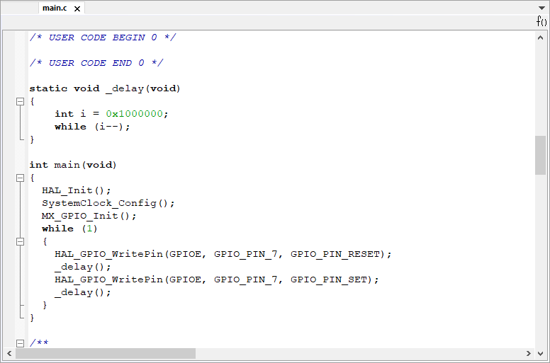
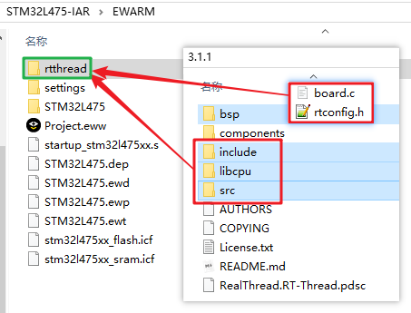
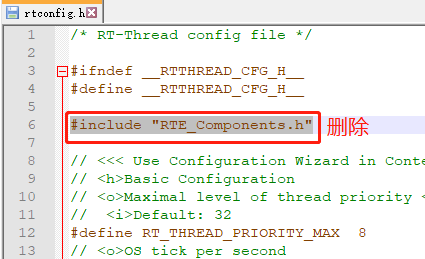
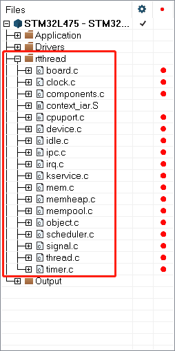
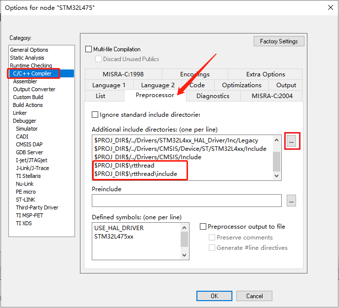
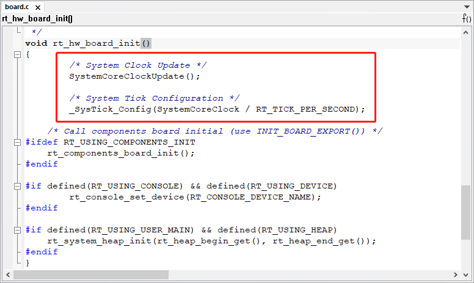
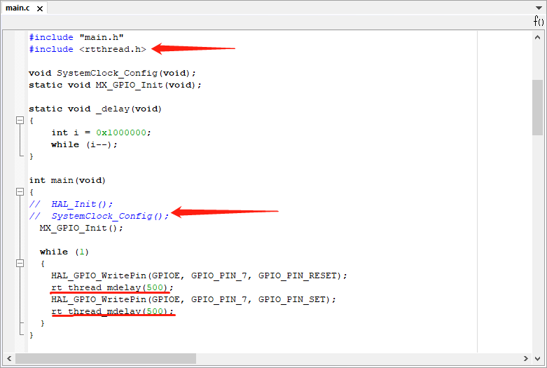

# 添加 Nano 到 IAR 

本文档介绍了 如何添加 RT-Thread nano 到 IAR 中，并以3.1.1为例做出说明。

## 1、准备工作

- 下载 RT-Thread nano 发布版本。
- 准备一份基础的裸机源码工程，如 LED 指示灯闪烁示例代码。

### 1.1、下载 Nano

[点击此处]()下载 RT-Thread nano。

### 1.2、基础工程准备 ###

在开始创建 RT-Thread 小系统之前，我们需要准备一个能正常运行的裸机工程。作为示例，本文使用的是基于 STM32L475-Pandora 和 HAL 库的一个 LED 闪烁程序。程序的主要截图如下：



在我们的例程中主要做了系统初始化与LED闪烁功能，编译下载程序后，就可以看到开发板上的 LED 在闪烁了。读者可以根据自己的需要使用其他芯片，完成一个简单的类似裸机工程。

## 2、添加 RT-Thread Nano 到工程 ##

### 2.1、添加源文件

在准备好的IAR裸机工程下面新建 rtthread 文件夹，并在该文件中添加以下文件：

- nano 源码中的 include、libcpu、src文件夹；
- nano 源码 bsp文件夹下的`board.c`与`rtconfig.h`。
- 右键 `rtconfig.h` 文件去除只读属性，打开 `rtconfig.h` ，删除  `#include "RTE_Components.h"`（该文件是KEIL自动生成的文件，在IAR中不使用，所以删除即可） 。





双击打开IAR裸机工程，新建rtthread分组，并在该分组下添加以下源码：

- 添加工程下 rtthread/src/ 文件夹中所有文件到工程；
- 添加工程下 rtthread/libcpu/ 文件夹中相应内核的CPU移植文件及上下文切换文件： `cpuport.c` 以及 `context_iar.S`；
- 添加 rtthread/ 文件夹下的 `board.c`。



Cortex-M 芯片内核移植代码：

```
context_iar.s
cpuport.c
```

Kernel 文件包括：

```
clock.c
components.c
device.c
idle.c
ipc.c
irq.c
kservice.c
mem.c
object.c
scheduler.c
thread.c
timer.c
```

应用代码：

```
board.c
```

### 2.2、添加头文件路径

点击 `Project -> Options... ` 进入下图所示界面，添加 rtconfig.h 头文件所在位置的路径，添加 include 文件夹下的头文件路径。



## 3、适配 RT-Thread

RT-Thread 会用到了异常处理函数 `HardFault_Handler()` 和悬挂处理函数 `PendSV_Handler()`，以及 Systick 中断服务函数 `SysTick_Handler()`，所以用户代码需要保证这几个函数没有被使用，若编译提示函数重复定义，请删除自己定义的函数。

RT-Thread Nano 在 board.c 中默认完成了 systick 的配置，用户可以通过修改宏 RT_TICK_PER_SECOND 的值配置每秒 systick 数。



RT-Thread Nano 默认是使用数组作为 heap。


替换应用例程 main() 中的 `delay` 函数：

1). 包含 RT-Thread 的相关头文件 `<rtthread.h>` 。

2). 删除之前在裸机工程中做的系统配置（如hal初始化、时钟初始化等），这是因为RT-Thread在系统启动时已经配置完成，否则会重复配置。

3). 将 `delay()` 函数替换成 `rt_thread_mdelay()`，如 `rt_thread_mdelay(500)` 将延时 500ms。

下面是完成修改的代码：



编译程序之后下载到芯片就可以看到基于 RT-Thread 的程序运行起来了，LED 正常闪烁。

> 注意事项：当添加 RT-Thread 之后，裸机中的 main() 函数会自动变成 RT-Thread 系统中 main 线程 的入口函数。由于线程不能一直独占 CPU，所以此时在 main() 中使用 while(1) 时，需要有让出 CPU 的动作，比如使用 `rt_thread_mdelay()` 系列的函数让出 CPU。另外3.0.3版本中还没有 `rt_thread_mdelay()` 接口，可以使用 `rt_thread_delay()` 。

## RT-Thread Nano 配置 ##

用户可以根据自己的需要通过打开或关闭 rtconfig.h 文件里面的宏定义，配置相应功能，如下是 rtconfig.h 的代码片段：

```c
...
    
// <h>IPC(Inter-process communication) Configuration
// <c1>Using Semaphore
//  <i>Using Semaphore
#define RT_USING_SEMAPHORE
// </c>
// <c1>Using Mutex
//  <i>Using Mutex
//#define RT_USING_MUTEX                 //打开此宏则使能互斥量的使用
// </c>
// <c1>Using Event
//  <i>Using Event
//#define RT_USING_EVENT                 //打开此宏则使能事件集的使用
// </c>
// <c1>Using MailBox
//  <i>Using MailBox
//#define RT_USING_MAILBOX              //打开此宏则使能邮箱的使用
// </c>
// <c1>Using Message Queue
//  <i>Using Message Queue
//#define RT_USING_MESSAGEQUEUE          //打开此宏则使能消息队列的使用
// </c>
// </h>

// <h>Memory Management Configuration
// <c1>Using Memory Pool Management
//  <i>Using Memory Pool Management
//#define RT_USING_MEMPOOL              //打开此宏则使能内存池的使用
    
...
```

RT-Thread Nano 默认未开启宏 RT_USING_HEAP，故只支持静态方式创建任务及信号量。若要通过动态方式创建对象则需要在 rtconfig.h 文件里开启 RT_USING_HEAP 宏定义。

