# 添加 Nano 到 MDK

本文档介绍了 如何添加 RT-Thread nano 到 MDK 中，并以3.1.1为例做出说明。

## 1、准备工作

- 在 KEIL 上安装 RT-Thread nano Pack。
- 准备一份基础的裸机源码工程，如 LED 指示灯闪烁示例代码。

### 1.1、Nano Pack 安装

Nano Pack 可以通过 MDK 联网安装，也可以手动安装。下面开始介绍两种安装方式。

#### 方法一：Pack Installer 安装

打开 MDK 软件，点击工具栏的 Pack Installer 图标：

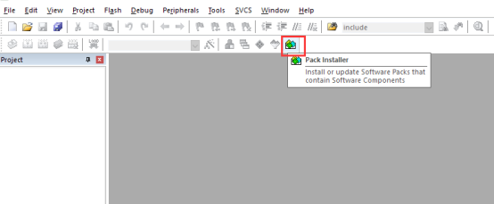

点击右侧的 Pack，展开 Generic，可以找到 RealThread::RT-Thread，点击 Action 栏对应的 Install ，就可以在线安装 Nano Pack 了。另外，如果需要安装其他版本，则需要展开 RealThread::RT-Thread，进行选择。

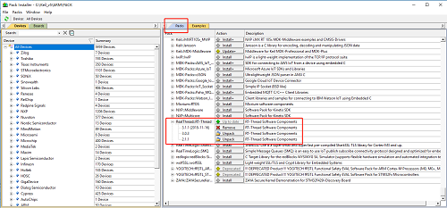

#### 方法二：手动安装

我们也可以从官网下载安装文件，[RT-Thread Nano 离线安装包下载](http://download.rt-thread.org/download/mdk/)，下载结束后双击文件进行安装：

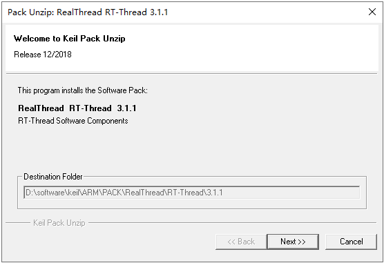

### 1.2、基础工程准备 ###

在开始创建 RT-Thread 小系统之前，我们需要准备一个能正常运行的裸机工程。作为示例，本文使用的是基于 STM32L475-Pandora 和 HAL 库的一个 LED 闪烁程序。程序的主要截图如下：

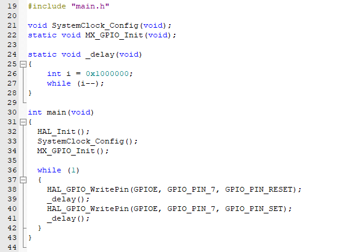

在我们的例程中主要做了系统初始化与LED闪烁功能，编译下载程序后，就可以看到 LED 闪烁了。读者可以根据自己的需要使用其他芯片，完成一个简单的类似裸机工程。

## 2、添加 RT-Thread Nano 到工程 ##

打开已经准备好的可以运行的裸机程序，将 RT-Thread 添加到工程。如下图，点击 Manage Run-Time Environment。

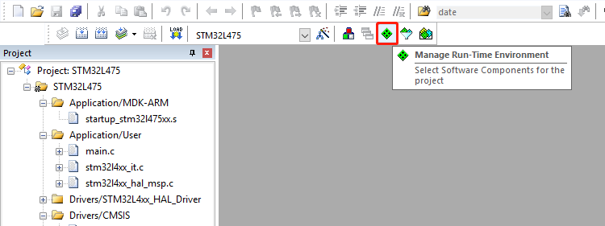

在 Manage Rum-Time Environment 里”Software Component” 栏找到 RTOS，Variant 栏选择 RT-Thread，然后勾选 kernel，点击”OK” 就添加 RT-Thread 内核到工程了。

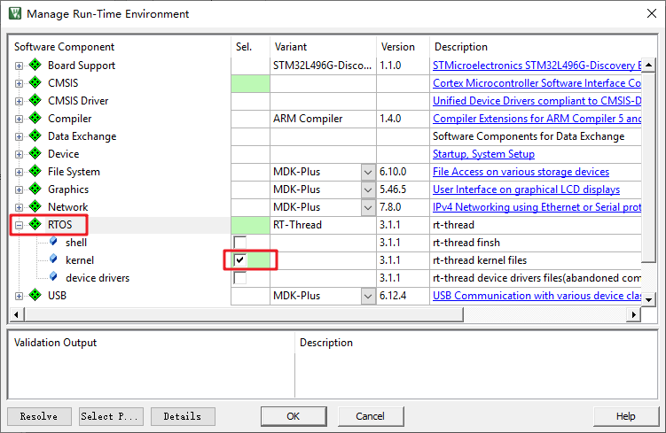

现在可以在 Project 看到 RT-Thread RTOS 已经添加进来了，展开 RTOS，可以看到添加到工程的文件：

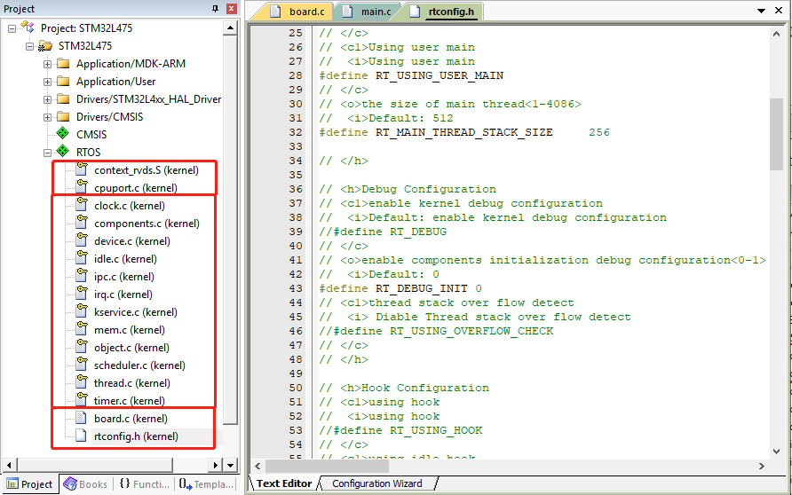

Cortex-M 芯片内核移植代码：

```
context_rvds.s
cpuport.c
```

Kernel 文件包括：

```
clock.c
components.c
device.c
idle.c
ipc.c
irq.c
kservice.c
mem.c
object.c
scheduler.c
thread.c
timer.c
```

应用代码及配置文件：

```
board.c
rtconfig.h
```

## 3、适配 RT-Thread

RT-Thread 会用到了异常处理函数 `HardFault_Handler()` 和悬挂处理函数 `PendSV_Handler()`，以及 Systick 中断服务函数 `SysTick_Handler()`，所以用户代码需要保证这几个函数没有被使用，若编译提示函数重复定义，请删除自己定义的函数。

RT-Thread Nano 在 board.c 中默认完成了 systick 的配置，用户可以修改宏 RT_TICK_PER_SECOND 的值配置每秒 systick 数。

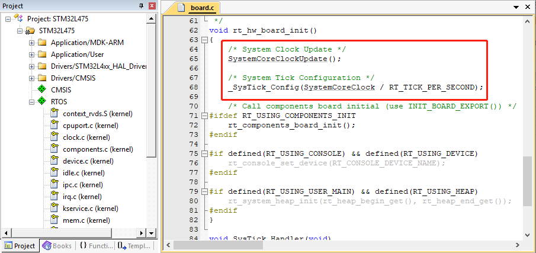

RT-Thread Nano 默认是使用数组作为 heap。

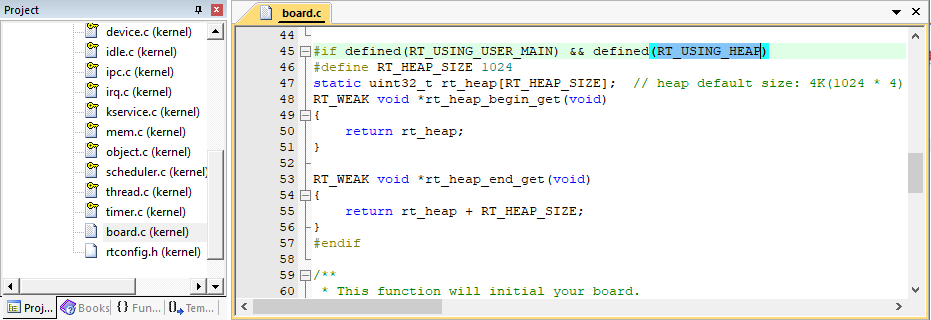

替换例程中的 `delay` 函数：

1). 包含 RT-Thread 的相关头文件 `<rtthread.h>` 。

2). 删除之前在裸机工程中做的系统配置（如hal初始化、时钟初始化等），这是因为RT-Thread在系统启动时已经配置完成，否则会重复配置。

3). 将 `delay()` 函数替换成 `rt_thread_mdelay()`，如 `rt_thread_mdelay(500)` 将延时 500ms。

下面是完成修改的代码：

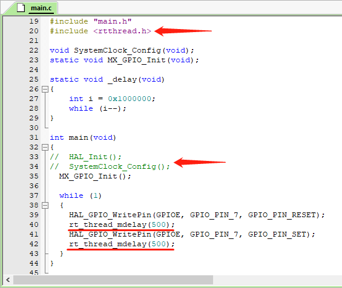

编译程序之后下载到芯片就可以看到基于 RT-Thread 的程序运行起来了，LED 正常闪烁。

> 注意事项：当添加 RT-Thread 之后，裸机中的 main() 函数会自动变成 RT-Thread 系统中 main 线程 的入口函数。由于线程不能一直独占 CPU，所以此时在 main() 中使用 while(1) 时，需要有让出 CPU 的动作，比如使用 `rt_thread_mdelay()` 系列的函数让出 CPU。另外3.0.3版本中还没有 `rt_thread_mdelay()` 接口，可以使用 `rt_thread_delay()` 。

## RT-Thread Nano 配置 ##

用户可以根据自己的需要通过修改 rtconfig.h 文件里面的宏定义配置相应功能。

RT-Thread Nano 默认未开启宏 RT_USING_HEAP，故只支持静态方式创建任务及信号量。若要通过动态方式创建对象则需要在 rtconfig.h 文件里开启 RT_USING_HEAP 宏定义。

MDK 的配置向导 configuration Wizard 可以很方便的对工程进行配置，Value 一栏可以选中对应功能及修改相关值，等同于直接修改配置文件 rtconfig.h。

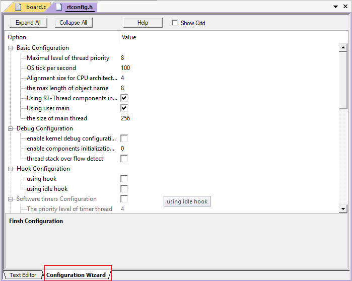

## 常见问题

1、如何升级 pack?

Pack 升级步骤基本如同软件包，展开 RealThread::RT-Thread 后，选择比较新的 Nano 版本，点击 Install 进行安装。如下图所示，点击红色框中的 Install 进行升级，即可将 3.1.1 版本升级到 3.1.2。

> 需要注意的是，若多个版本同时安装，则最终向工程添加 nano 时，只能选择高版本进行添加。

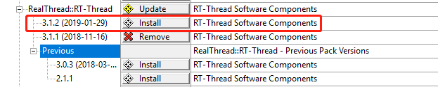


